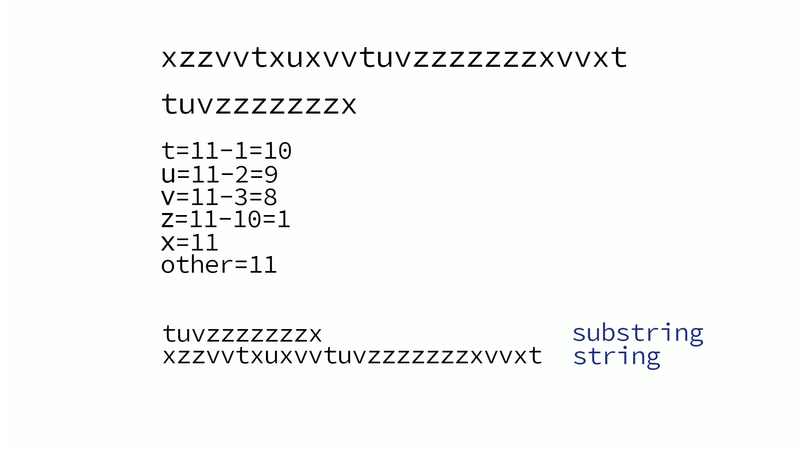

## Contribution
Vous pouvez contribuer à l'amélioration de la documentation, en ajoutant, modifiant ou supprimant des éléments.

## Explication
[L'algorithme de Boyer-Moore-Horspool](https://fr.wikipedia.org/wiki/Algorithme_de_Boyer-Moore-Horspool) est un algorithme de [recherche de sous-chaîne](https://fr.wikipedia.org/wiki/Algorithme_de_recherche_de_sous-cha%C3%AEne).

Il fait un prétraitement sur la sous-chaîne en créant un tableau avec les sauts à faire pour éviter de la recherche inutile.

L'algorithme se découpe en 2 parties, une phase de construction du tableau de saut et une phase de recherche.

### Construction de la Table [[Code table](../bmh/table.go)]

Pour la construction de la table, il suffit de compter le decalage a faire a partir de la fin de la sous-chaîne.

Pour `tuvzzzzzzzx` le tableau donne `t=10, u=9, v=8, z=1, other=11`.

Si le caractere se repete, on prend la derniere occurence.

Le dernier caractere n'est pas compter, si il est rencontrer dans la sous-chaine, on inscrira le dernier dans la table.

ex: `tuvzxzzzzzx` => `t=10, u=9, v=8, x=6, z=1, other=11`.


### Recherche de la sous-chaîne [[Code table](../bmh/search.go)]

Pour la recherche, on compare en commencant par la fin de la sous-chaîne.

Ce qui permet de faire des sauts.

exemple:
```
wwwwwwwwww|w|wwwwwwwwwwwwww  
tuvzxzzzzz|x|

Les caracteres ne sont pas identique, et 'w' n'est pas dans la table.
Donc aucune raison de comparer les caracteres precedent, alors on saute de la longueur de la table (11)

wwwwwwwwwwwwwwwwwwwwwww|w|w  
             tuvzxzzzzz|x|

``` 

