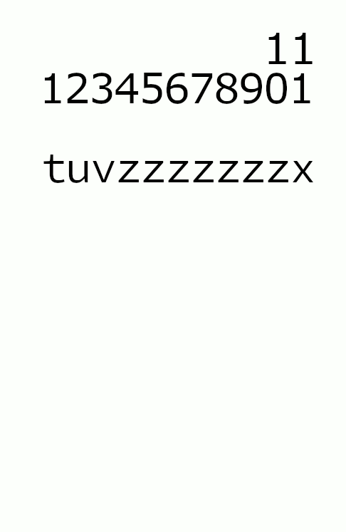

## Contribution
Vous pouvez contribuer à l'amélioration de la documentation, en ajoutant, modifiant ou supprimant des éléments.

## Explication
[L'algorithme de Boyer-Moore-Horspool](https://fr.wikipedia.org/wiki/Algorithme_de_Boyer-Moore-Horspool) est un algorithme de [recherche de sous-chaîne](https://fr.wikipedia.org/wiki/Algorithme_de_recherche_de_sous-cha%C3%AEne).

Il fait un prétraitement sur la sous-chaîne en créant un tableau avec les sauts à faire pour éviter de la recherche inutile.

L'algorithme se découpe en 2 parties, une phase de construction du tableau de saut et une phase de recherche.

### Construction de la Table [[Code table](../bmh/table.go)]

Pour la construction de la table, il suffit de compter le décalage à faire à partir de la fin de la sous-chaîne.

Pour `tuvzzzzzzzx` le tableau donne `t=10, u=9, v=8, z=1, other=11`.

Si le caractère se répète, on prend la dernière occurrence.

Le dernier caractère n'est pas compté, s'il est rencontré dans la sous-chaîne, on inscrira le dernier dans la table.

ex: `tuvzxzzzzzx` => `t=10, u=9, v=8, x=6, z=1, other=11` (Cet exemple est different de l'animation `tuvzxzzzzzx` != `tuvzzzzzzzx`).

#### Composition du code
```go
table.go

8   for i := 0; i < 256; i++ {
9       t.Content[i] = num
10  }
```
On initialise la table avec la taille de la sous-chaîne.  
La taille de la table fait `256`, ce qui représente la valeur maximale d'un char, donc on ne gère pas l'UTF-8.

```go
table.go

17  for i := 0; i < (lenPattern - 1); i++ {
18      t.Content[pattern[i]] = (lenPattern - 1) - i
19  }
```
On inscrit la position du caractère pointer par rapport à la fin de la sous-chaîne.  
Le `-1` permet de ne pas compter le dernier caractère.  
Et on utilise la valeur ASCII du caractère comme index du tableau. (ex: `'A'` vaut 65)




### Recherche de la sous-chaîne [[Code recherche](../bmh/search.go)]

Pour la recherche, on compare en commençant par la fin de la sous-chaîne.

Ce qui permet de faire des sauts.

exemple:
```
wwwwwwwwww|w|wwwwwwwwwwwwww  
tuvzxzzzzz|x|

Les caractères ne sont pas identiques, et "w" n'est pas dans la table.
Donc aucune raison de comparer les caractères précédents, alors on saute de la longueur de la sous-chaîne (11)

wwwwwwwwwwwwwwwwwwwwwww|w|w  
             tuvzxzzzzz|x|

``` 
#### Composition du code
```go
search.go

12  for (idxBuffer + lenPattern) <= lenBuffer {
```
On parcourt la chaîne jusqu'à que la taille de la chaîne soit plus grande que la taille de la sous-chaîne.

```go
search.go

13  idxPattern = lenPattern - 1
```
On initialise l'index de la sous-chaîne avec sa taille.
Et on décrémentera s'il y a match.

```go
search.go

15  for buffer[idxBuffer + idxPattern] == pattern[idxPattern] {
16      if idxPattern == 0 {
17          position = idxBuffer
18          return position
19      }
20      idxPattern -= 1
21  }
```
On compare chaque caractère de la chaîne avec la sous-chaîne, s'ils sont identiques, on décrémente.  
Si l'index de la sous-chaîne est égal à `0`, alors on a trouvé une occurrence de la sous-chaîne dans la chaîne, on peut renvoyer la position.

```go
search.go

23  idxBuffer += table.Content[buffer[idxBuffer + idxPattern]]
```
Si on arrive à cette ligne, c'est qu'il y a eu une différence de caractères.  
On prend la valeur du caractère qui n'a pas matché dans la table.  
Si le caractère existe, on prend la position de la dernière occurrence dans la sous-chaîne, sinon la taille de la sous-chaîne.  
Et on l'additionne à l'index de la chaîne.


